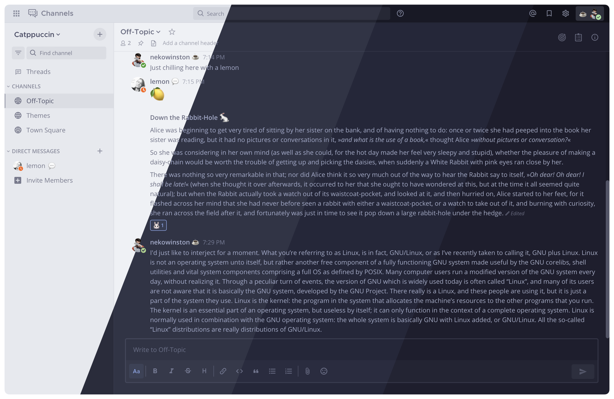
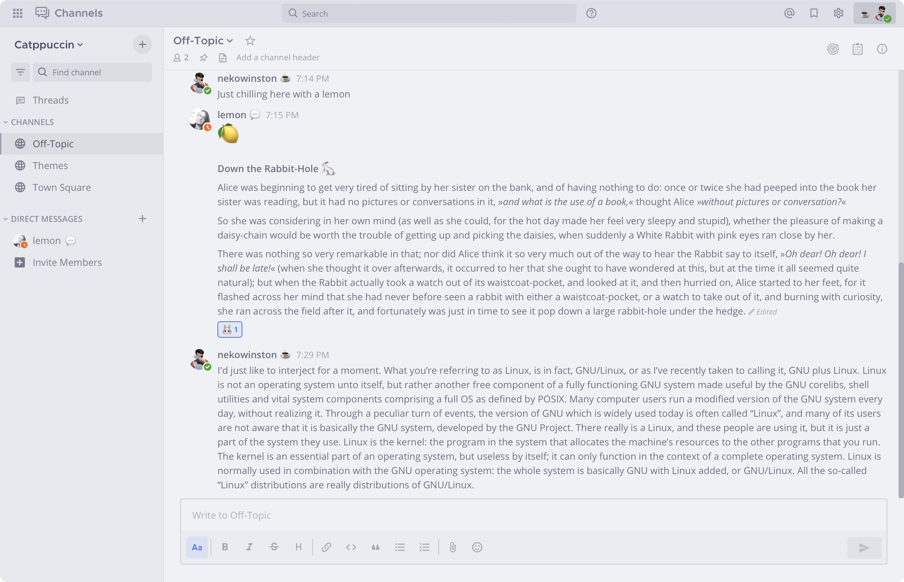
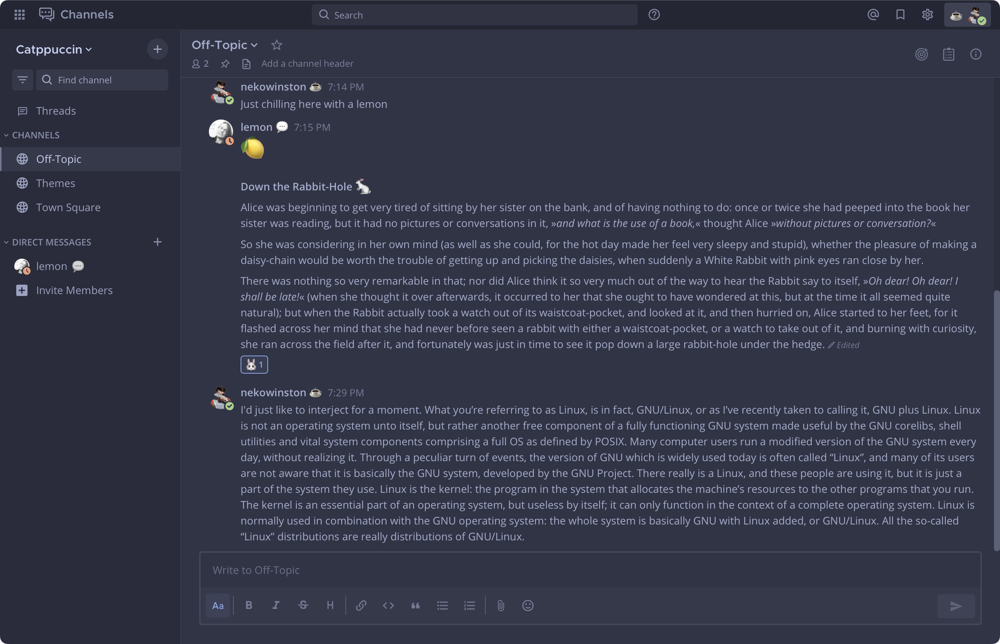
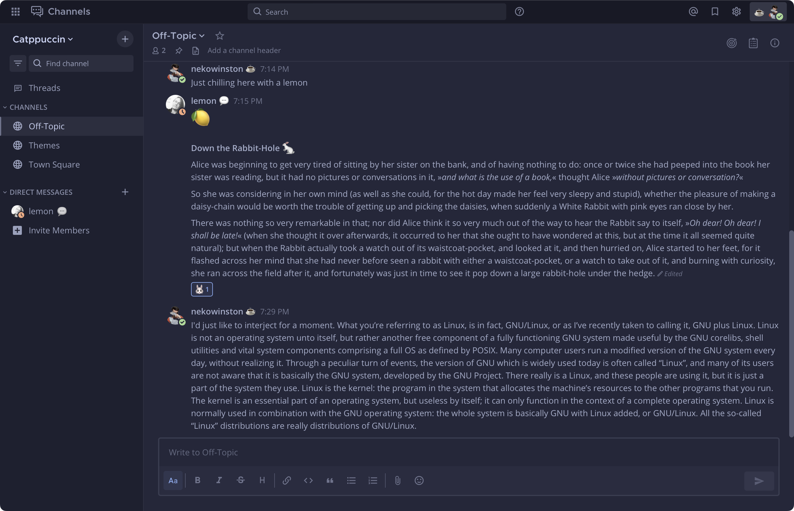
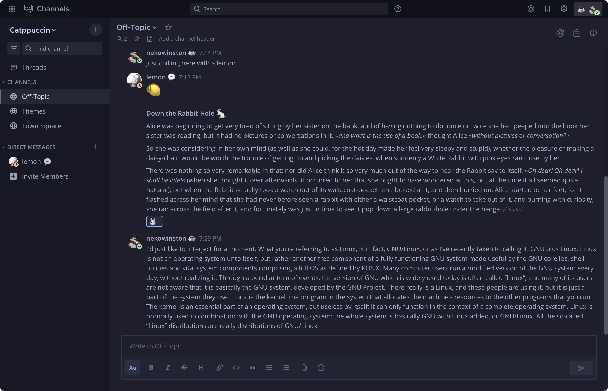

<h3 align="center">
	 
	
	Catppuccin for <a href="https://github.com/mattermost/">Mattermost</a>
	
</h3>

	
	
	

	

## Previews

🌻 Latte

🪴 Frappé

🌺 Macchiato

🌿 Mocha

## Usage

1. Open the settings in Mattermost (cog in the top right)
2. Navigate to "Display > Theme" and select "Edit"
3. Select "Custom Theme"
4. Paste your preferred flavor into the "Copy and paste to share theme colors"
   section:

🌻 Latte

<pre>
{"sidebarBg":"#e6e9ef","sidebarText":"#4c4f69","sidebarUnreadText":"#40a02b","sidebarTextHoverBg":"#9ca0b0","sidebarTextActiveBorder":"#9ca0b0","sidebarTextActiveColor":"#eff1f5","sidebarHeaderBg":"#dce0e8","sidebarHeaderTextColor":"#4c4f69","onlineIndicator":"#40a02b","mentionBg":"#ea76cb","awayIndicator":"#fe640b","dndIndicator":"#d20f39","mentionBj":"#dce0e8","mentionColor":"#dce0e8","centerChannelBg":"#eff1f5","centerChannelColor":"#6c6f85","newMessageSeparator":"#d20f39","linkColor":"#dc8a78","buttonBg":"#1e66f5","buttonColor":"#eff1f5","errorTextColor":"#d20f39","mentionHighlightBg":"#e6e9ef","mentionHighlightLink":"#dc8a78","codeTheme":"GitHub","sidebarTeamBarBg":"#dce0e8"}
</pre>

🪴 Frappé

<pre>
{"sidebarBg":"#292c3c","sidebarText":"#c6d0f5","sidebarUnreadText":"#a6d189","sidebarTextHoverBg":"#737994","sidebarTextActiveBorder":"#737994","sidebarTextActiveColor":"#303446","sidebarHeaderBg":"#232634","sidebarHeaderTextColor":"#c6d0f5","onlineIndicator":"#a6d189","mentionBg":"#f4b8e4","awayIndicator":"#ef9f76","dndIndicator":"#e78284","mentionBj":"#232634","mentionColor":"#232634","centerChannelBg":"#303446","centerChannelColor":"#a5adce","newMessageSeparator":"#e78284","linkColor":"#f2d5cf","buttonBg":"#8caaee","buttonColor":"#303446","errorTextColor":"#e78284","mentionHighlightBg":"#292c3c","mentionHighlightLink":"#f2d5cf","codeTheme":"Monokai","sidebarTeamBarBg":"#232634"}
</pre>

🌺 Macchiato

<pre>
{"sidebarBg":"#1e2030","sidebarText":"#cad3f5","sidebarUnreadText":"#a6da95","sidebarTextHoverBg":"#6e738d","sidebarTextActiveBorder":"#6e738d","sidebarTextActiveColor":"#24273a","sidebarHeaderBg":"#181926","sidebarHeaderTextColor":"#cad3f5","onlineIndicator":"#a6da95","mentionBg":"#f5bde6","awayIndicator":"#f5a97f","dndIndicator":"#ed8796","mentionBj":"#181926","mentionColor":"#181926","centerChannelBg":"#24273a","centerChannelColor":"#a5adcb","newMessageSeparator":"#ed8796","linkColor":"#f4dbd6","buttonBg":"#8aadf4","buttonColor":"#24273a","errorTextColor":"#ed8796","mentionHighlightBg":"#1e2030","mentionHighlightLink":"#f4dbd6","codeTheme":"Monokai","sidebarTeamBarBg":"#181926"}
</pre>

🌿 Mocha

<pre>
{"sidebarBg":"#181825","sidebarText":"#cdd6f4","sidebarUnreadText":"#a6e3a1","sidebarTextHoverBg":"#6c7086","sidebarTextActiveBorder":"#6c7086","sidebarTextActiveColor":"#1e1e2e","sidebarHeaderBg":"#11111b","sidebarHeaderTextColor":"#cdd6f4","onlineIndicator":"#a6e3a1","mentionBg":"#f5c2e7","awayIndicator":"#fab387","dndIndicator":"#f38ba8","mentionBj":"#11111b","mentionColor":"#11111b","centerChannelBg":"#1e1e2e","centerChannelColor":"#a6adc8","newMessageSeparator":"#f38ba8","linkColor":"#f5e0dc","buttonBg":"#89b4fa","buttonColor":"#1e1e2e","errorTextColor":"#f38ba8","mentionHighlightBg":"#181825","mentionHighlightLink":"#f5e0dc","codeTheme":"Monokai","sidebarTeamBarBg":"#11111b"}
</pre>

## 💝 Thanks to

- [winston](https://github.com/nekowinston)

&nbsp;

	

	Copyright &copy; 2021-present <a href="https://github.com/catppuccin" target="_blank">Catppuccin Org</a>

	

